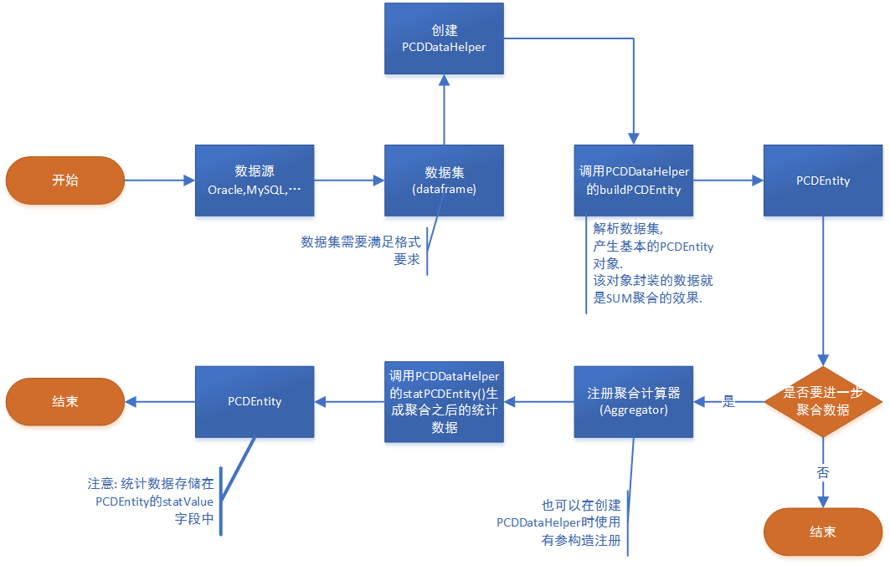

PCDDataHelper
=============

> 本插件的初衷是为了方便java程序员后台封装数据, 提供给类似`highchart`这类
前台可视化展示框架使用.

以省市区数据为例. 有两种思路: 
1. 分批查数,即遍历不同的省, 进而获取省
下的所有市.... 
2. 一次性查询所有省市区数据,再加工处理.

思路1的缺点:1.需要写很多sql语句;2.数据表结构变化,sql语句也要跟着变.

本人是一个不喜欢写sql的人, 于是想实现第二种, 我觉的第二种更具有通用性.
只需要按照格式要求, 一次性获取数据集, 然后利用本插件自动加工成
需要的数值.


什么是PCDData?
--------------

-   P:province

-   C:city

-   D:district

也就是中国的省市区三级行政区划. 本工具包将所有形如这种有层次级别的数据统称为
**PCDData**. 省市区这种数据使用非常广泛, 便于理解, 这么命名也是合理的.

使用说明
--------

### 使用流程



### 示例代码[^1]

[^1]: 相依代码示例请参考demo.

```

//获取数据集dataframe(略)

//创建助手  
**PCDDataHelper** helper = **new PCDDataHelper**();  
  
**PCDEntity** root = helper.buildPCDEntity(dataframe, **new int**[]{**0**,
**2**, **4**}, **new int**[]{**1**, **3**, **5**}, **6**);

helper.setAggregator(new MaxAggregator());

//调用方法统计数据  
**PCDEntity** rootAfterAggregate = helper1.statPCDEntity(root);  
**System**.*out*.println(rootAfterAggregate.toString());

```

数据集格式要求
--------------

数据集格式要如下表所示. 使用中可以很灵活.
具体需要的列元素可以在调用buildPCDEntity()时指定.

-   列的顺序可以随意.

-   列的数目可以随意

但, 必须能够给程序提供对应的元素. **级别ID, 级别名称, 元数据**[^2].
其中级别ID有时候可以直接用级别名称(*前提是保证名称唯一*).

[^2]: 数据集最小颗粒度的数据.

本测试数据已经内置于jar包, 并且运行**demo**包下的Demo类可以演示.

**表: 数据样式表**

| PID | 省   | CID | 市   | DID | 区   | GDP |
|-----|------|-----|------|-----|------|-----|
| 100 | 安徽 | 110 | 合肥 | 111 | 包河 | 12  |
| 100 | 安徽 | 110 | 合肥 | 112 | 滨湖 | 21  |
| 100 | 安徽 | 120 | 安庆 | 121 | 大观 | 65  |
| 200 | 河南 | 210 | 郑州 | 211 | 中原 | 24  |
| 200 | 河南 | 210 | 郑州 | 212 | 新郑 | 78  |
| 300 | 山西 | 310 | 太原 | 311 | 晋源 | 42  |
| 400 | 北京 | 410 | 北京 | 411 | 海淀 | 58  |


关于聚合计算器
--------
经过 `buildPCDEntity(..)`之后, 只是初步的累加数据.
即`SUM`聚合效果.

但是如果需要每组的均值,最大值,最小值,甚至自定义的计算规则. 原始的`PCDEntity`
显然无法做到这点.

因此, 本程序提供了`Aggravator`接口, 如果要实现自定义的
复杂聚合规则, 则只需要实现本接口, 实现里面`aggravate()`即可.
(如果您只是先要均值,最大值这些基本的结果, 则可以使用内置的聚合器.)

### 如何自定义聚合计算器

首先, 明确一个概念: **横向依赖型聚合**和**纵向依赖型聚合**.
- **纵向依赖型**: 大部分常规聚合都是属于这个类型, 如`sum`,`mean`,`max`..., 这类的特性是, 本级别
`PCDEntity`的聚合结果依赖于子集的数据. 比如"广东省的平均GDP是其下所有
市的GDP平均值", "浙江省的最大GDP依赖于其下所有城市的GDP最大者". 这样将某级别的**组**数据聚合计算后, 需要向上级**报告**. 
所谓报告, 就是将结果设置给父级的`statValue`字段(**重要**).
- **横向依赖型**: 这类聚合计算只会依赖于本级别*组*的数据.
如"广东省下所有城市的GDP份额只依赖于各市自身的GDP和同级别的
其他市的GDP". **注意***:这类型的聚合结果**不能上报**.

下面针对两种类型分别给出自定义聚合器的示例代码:
#### 自定义纵向依赖型聚合计算器
需求: 统计出每个`PCDEntity`中GDP离差最大值. 离差是自己数值除以均值.
```
//group就是某一级别的所有PCDEntity实例组成数组, 即组.
public void aggregate(PCDEntity[] group) {
   //求出均值(可以求出本组数值之和除以总数目, 这里采取简单的方法, 利用父级数值, 父级数据默认就是下级数值之和)
   //拿出上级
   PCDEntity parent = group[0].getParent();
   //取出默认的基本数值,即下级基本值之和,Number类型转成double类型
   double sum = parent.getValue().doubleValue();
   //计算均值
   double mean = sum / group.length;
   //遍历组,计算每个成员的离差并得出最大值
   double maxdev = group[0].getValue().doubleValue()-mean;
   for (PCDEntity m : group) {
       double v = m.getValue().doubleValue() - mean;
       if (v > maxdev) {
           maxdev = v;
       }
   }
   //!将最终得到最大离差向上级报告!
   parent.setStatValue(maxdev); //!statValue字段,不可污染基础数据value字段!
   //搞定!!
}

```

#### 自定义横向依赖型聚合计算器
需求: 统计计算各`PCDEntity`的GDP份额.
```
public void aggregate(PCDEntity[] group) {
    //各成员数值除以总和乘以100就是百分比
    //获取本组GDP之和(这里从父级那里拿)
    double denomi = group[0].getParent().getValue().doubleValue();
    //遍历组,每个成员更新statValue字段,不需要上报
    for (PCDEntity m : group) {
        m.setStatValue(m.getValue().doubleValue()/denomi*100);
    }
    //搞定!
}
```







反馈建议
--------

由于水平有限, 存在一些设计不足的地方. 期待更好的建议.

* \@author Nisus-Liu  
* \@email liuhejunlj\@163.com
